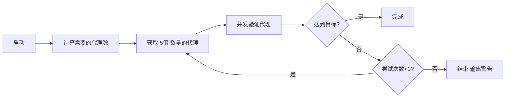

# ProxyForge

基于 FastAPI 和 [freeproxy](https://github.com/CharlesPikachu/freeproxy) 的代理服务,提供代理池管理和代理请求转发功能。

## 功能特性

- ✅ **代理池管理**: 自动获取、验证和更新免费代理
  - 智能获取策略:考虑到免费代理有效率约 20%,自动获取 5 倍数量的代理
  - 多轮获取机制:最多尝试 3 轮,直到达到目标代理数
  - 多源并发:同时从 5 个代理源获取,提高效率
- ✅ **代理查询**: 提供代理列表、随机获取、统计等接口
- ✅ **请求转发**: 通过代理发送 HTTP 请求,支持所有 HTTP 方法
- ✅ **自动重试**: 请求失败自动切换代理重试
- ✅ **异步高性能**: 基于 FastAPI 和 httpx 的异步实现
- ✅ **完整文档**: 自动生成的 API 文档

## 快速开始

### 环境要求

- Python 3.8+
- pip

### 安装

#### 方法 1: Docker 部署 (推荐) 🐳

```bash
# 使用 docker-compose
docker-compose up -d

# 查看日志
docker-compose logs -f

# 访问服务
# API 文档: http://localhost:8000/docs
```

详细说明请查看 [DOCKER.md](DOCKER.md)

#### 方法 2: 本地安装

1. 克隆项目
```bash
git clone <repository-url>
cd proxyforge
```

2. 使用启动脚本(推荐)

**Linux/Mac:**
```bash
chmod +x start.sh
./start.sh
```

**Windows:**
```bash
start.bat
```

3. 或手动安装
```bash
# 创建虚拟环境
python -m venv venv

# 激活虚拟环境
# Linux/Mac:
source venv/bin/activate
# Windows:
venv\Scripts\activate

# 安装依赖
pip install -r requirements.txt

# 复制配置文件
cp .env.example .env

# 启动服务
python -m uvicorn app.main:app --host 0.0.0.0 --port 8000 --reload
```

### 访问服务

- **API 文档**: http://localhost:8000/docs
- **健康检查**: http://localhost:8000/health

## API 使用示例

### 1. 获取代理列表

```bash
curl http://localhost:8000/api/proxy/list
```

### 2. 获取随机代理

```bash
curl http://localhost:8000/api/proxy/random
```

### 3. 获取代理池统计

```bash
curl http://localhost:8000/api/proxy/stats
```

### 4. 通过代理发送请求

**GET 请求:**
```bash
curl -X POST http://localhost:8000/api/request \
  -H "Content-Type: application/json" \
  -d '{
    "url": "https://httpbin.org/ip",
    "method": "GET"
  }'
```

**POST 请求:**
```bash
curl -X POST http://localhost:8000/api/request \
  -H "Content-Type: application/json" \
  -d '{
    "url": "https://httpbin.org/post",
    "method": "POST",
    "headers": {
      "User-Agent": "ProxyForge/1.0"
    },
    "json": {
      "key": "value"
    }
  }'
```

**带参数的请求:**
```bash
curl -X POST http://localhost:8000/api/request \
  -H "Content-Type: application/json" \
  -d '{
    "url": "https://httpbin.org/get",
    "method": "GET",
    "params": {
      "foo": "bar"
    },
    "headers": {
      "Custom-Header": "value"
    },
    "timeout": 30,
    "max_retries": 3
  }'
```

### 5. 手动更新代理池

```bash
curl -X POST http://localhost:8000/api/proxy/update
```

### 6. 删除失效代理

```bash
curl -X DELETE http://localhost:8000/api/proxy/{proxy_id}
```

## 配置说明

编辑 `.env` 文件进行配置:

```env
# 服务配置
HOST=0.0.0.0
PORT=8000
DEBUG=True

# 代理池配置
PROXY_POOL_SIZE=100              # 代理池大小
PROXY_UPDATE_INTERVAL=3600       # 更新间隔(秒)
PROXY_VALIDATION_TIMEOUT=10      # 验证超时(秒)
PROXY_VALIDATION_URL=https://httpbin.org/ip

# 请求配置
REQUEST_TIMEOUT=30               # 请求超时(秒)
REQUEST_MAX_RETRIES=3            # 最大重试次数

# 日志配置
LOG_LEVEL=INFO
LOG_FILE=logs/proxyforge.log
```

## 项目结构

```
proxyforge/
├── app/
│   ├── __init__.py
│   ├── main.py              # FastAPI 应用入口
│   ├── config.py            # 配置管理
│   ├── models.py            # 数据模型
│   ├── api/
│   │   ├── __init__.py
│   │   ├── proxy.py         # 代理查询接口
│   │   └── request.py       # 代理请求接口
│   ├── core/
│   │   ├── __init__.py
│   │   ├── proxy_pool.py    # 代理池管理
│   │   ├── proxy_fetcher.py # 代理获取
│   │   ├── proxy_validator.py # 代理验证
│   │   └── request_handler.py # 请求处理
│   └── utils/
│       └── __init__.py      # 日志工具
├── requirements.txt
├── setup.py
├── .env.example
├── start.sh                 # Linux/Mac 启动脚本
├── start.bat                # Windows 启动脚本
└── README.md
```

## 技术栈

- **FastAPI**: 高性能 Web 框架
- **uvicorn**: ASGI 服务器
- **httpx**: 异步 HTTP 客户端
- **freeproxy**: 免费代理获取库
- **APScheduler**: 任务调度
- **pydantic**: 数据验证
- **loguru**: 日志管理

## 代理池工作原理

### 智能获取策略

由于免费代理的有效率通常只有 **20% 左右**,ProxyForge 采用了智能获取策略:

```
目标代理数: 100
有效率估算: 20%
实际获取数: 100 × 5 = 500
```

### 多轮获取机制

```
第1轮: 获取 500 个代理 → 验证 → 得到约 100 个有效代理 ✓
如果不足:
第2轮: 获取剩余需要的 × 5 倍代理 → 验证 → 补充
第3轮: 继续补充...
```

### 工作流程



### 代理源

当前使用的代理源(按顺序):

1. **KuaidailiProxiedSession** - 快代理
2. **ProxylistProxiedSession** - Proxylist
3. **QiyunipProxiedSession** - 旗云IP
4. **IP3366ProxiedSession** - IP3366
5. **FreeproxylistProxiedSession** - Free Proxy List

### 验证机制

- **并发验证**: 默认并发数 10,避免过载
- **验证URL**: https://httpbin.org/ip
- **超时设置**: 10 秒
- **验证指标**: 
  - 连接成功性
  - 响应速度
  - 匿名性

### 示例日志解读

```
2025-12-30 13:33:30 | INFO | 开始更新代理池
2025-12-30 13:33:30 | INFO | 第 1 轮获取代理,目标: 500 个
2025-12-30 13:33:48 | INFO | 从 KuaidailiProxiedSession 获取到 30 个代理
2025-12-30 13:33:49 | INFO | 从 ProxylistProxiedSession 获取到 817 个代理
2025-12-30 13:33:49 | INFO | 成功获取 500 个代理
2025-12-30 13:33:49 | INFO | 开始验证 500 个代理,并发数: 10
2025-12-30 13:34:48 | INFO | 代理验证完成,有效: 100/500
2025-12-30 13:34:48 | INFO | 第 1 轮添加了 100 个有效代理
2025-12-30 13:34:48 | INFO | 已达到目标代理数,当前有效代理: 100
2025-12-30 13:34:48 | INFO | 代理池更新完成,当前有效代理数: 100/100
```

**解读**:
- 获取了 500 个代理(来自 2 个源)
- 验证后得到 100 个有效代理(有效率 20%)
- 达到目标,无需第2轮

## 注意事项

1. **代理质量**: 免费代理的稳定性和速度可能不如付费代理
2. **更新频率**: 建议根据实际需求调整代理池更新间隔
3. **并发限制**: 验证代理时会有并发限制,避免对代理源造成压力
4. **合法使用**: 请确保使用代理服务符合目标网站的服务条款

## 常见问题 (Q&A)

### Q1: 为什么代理池没有达到设置的大小?

**A**: 这是正常现象。免费代理有效率通常只有 10-30%,系统会尝试 3 轮获取,但可能仍无法达到目标。例如设置 `PROXY_POOL_SIZE=100`,实际可能只有 85-95 个有效代理。

**解决方案**:
- 接受现状 (85%+ 已经很好)
- 增加 `PROXY_POOL_SIZE` 到 120-150
- 等待定时更新 (每小时自动更新)

---

### Q2: 为什么有些代理源永远用不到?

**A**: 因为前面的代理源(特别是 ProxylistProxiedSession)通常能提供足够多的代理。系统会按顺序获取,一旦达到目标数量就停止,所以后面的源很少被使用。

**这是正常的设计**,优先考虑速度和效率。

---

### Q3: 请求返回 403/429 怎么办?

**A**: 可以配置 `retry_on_status_codes` 参数,让系统自动切换代理重试:

```json
{
  "url": "https://example.com/api",
  "retry_on_status_codes": [403, 429, 502, 503],
  "max_retries": 5
}
```

详见 [STATUS_CODE_RETRY.md](STATUS_CODE_RETRY.md)

---

### Q4: 启动太慢怎么办?

**A**: 当前快速启动模式只需 10-15 秒。如果还是太慢:
- 减小快速启动代理数 (修改代码中的 `quick_start_count = 10` 改为 `5`)
- 使用 Docker 部署,容器启动更快

---

### Q5: 如何提高代理质量?

**A**: 免费代理质量有限,建议:
1. 增加 `PROXY_POOL_SIZE` 获取更多代理
2. 减小 `PROXY_VALIDATION_TIMEOUT` 更快淘汰慢速代理
3. 使用付费代理服务 (需要自行修改代码)

---

### Q6: 支持哪些 HTTP 方法?

**A**: 支持所有标准 HTTP 方法: GET, POST, PUT, DELETE, PATCH, HEAD, OPTIONS

---

### Q7: 可以用于生产环境吗?

**A**: 可以,但建议:
- 使用 Docker 部署
- 配置资源限制
- 监控代理池健康度
- 准备备用方案 (免费代理不稳定)

详见 [DOCKER.md](DOCKER.md) 生产环境配置

---

### Q8: 如何查看详细日志?

**A**: 
```bash
# 查看实时日志
tail -f logs/proxyforge.log

# 查看错误日志
grep "ERROR" logs/proxyforge.log

# 使用 Docker
docker-compose logs -f
```

---

### Q9: 代理池多久更新一次?

**A**: 默认每小时更新一次 (`PROXY_UPDATE_INTERVAL=3600` 秒)。可以通过环境变量调整,或手动触发:

```bash
curl -X POST http://localhost:8000/api/proxy/update
```

---

### Q10: 如何贡献代码?

**A**: 欢迎提交 PR!
1. Fork 项目
2. 创建功能分支
3. 提交代码并测试
4. 发起 Pull Request

更多问题请查看 [ERROR_LOGS.md](ERROR_LOGS.md) 和 [STRATEGY.md](STRATEGY.md)

## License

MIT License

## 贡献

欢迎提交 Issue 和 Pull Request!
